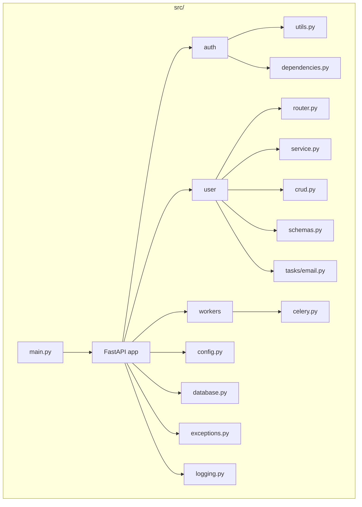

# User Registration API

This repository provides an API for user registration and email verification using FastAPI.

## Features

- Register a user with email and password
- Send a 4-digit verification code via email
- Activate a user account using HTTP Basic Auth with the received code
- The verification code is valid for 1 minute only

## Architecture

### Docker Services

This project is structured into the following Docker services:

- **FastAPI**: Handles HTTP requests and business logic
- **PostgreSQL**: Stores user and verification data
- **MailDev**: Simulates an SMTP email server
- **RabbitMQ**: Message broker for background tasks
- **Celery Worker**: Processes asynchronous tasks

```mermaid
architecture-beta
    service localhost(server)[Host]

    group docker_compose[Docker Compose]
    service api(server)[FastAPI] in docker_compose
    service db(database)[PostgreSQL] in docker_compose
    service email(server)[MailDev] in docker_compose
    service broker(queue)[RabbitMQ] in docker_compose
    service worker(worker)[Celery Worker] in docker_compose
    junction junction_host_email

    localhost:R <--> L:api

    api:B <--> T:db

    api:R --> L:broker
    broker:T --> B:worker
    worker:L --> R:email

    email:L -- R:junction_host_email
    junction_host_email:B --> T:localhost
    localhost:T <-- B:junction_host_email    
```



### Codebase Structure

The application follows a modular layout inside `src/`:

- `main.py`: FastAPI app entry point
- `auth/`: Authentication-related utilities and dependencies
- `user/`: User logic including schemas, service, tasks, and routes
- `workers/`: Celery configuration
- Shared modules: `config.py`, `database.py`, `exceptions.py`, `logging.py`



## Setup

### Prerequisites

Make sure you have the following installed:

- [Docker](https://docs.docker.com/get-docker/)
- [Docker Compose](https://docs.docker.com/compose/install/)

### Environment File

Only a file named `.env` is automatically loaded by Docker Compose. If you want to use `.env.dev` or another custom
file, you must explicitly specify it using the `--env-file` option.

For example:

```bash
docker compose --env-file <your-env-file> up --build
```

> Replace `<your-env-file>` with the name of your environment file (e.g., `.env.dev`, `.env.prod`). This is required if
> your file is not named exactly `.env`.

Alternatively, you can rename your file to `.env` to have it picked up automatically.

You can create a custom one:

```bash
cp .env.example .env.dev
```

Modify it according to your needs.

## Usage

### Start in Development Mode (with override)

Use the default `docker-compose.override.yml` to enable volume mounting and code reload:

```bash
docker compose --env-file <your-env-file> up --build
```

> Replace `<your-env-file>` with the name of your environment file (e.g., `.env.dev`, `.env.prod`). This is required if
> your file is not named exactly `.env`.

In this mode, the development server watches your code and restarts automatically on changes.

### Start in Production Mode (without override)

This uses only `docker-compose.yml`:

```bash
docker compose --env-file <your-env-file> -f docker-compose.yml up --build
```

> Replace `<your-env-file>` with the name of your environment file (e.g., `.env.dev`, `.env.prod`). This is required if
> your file is not named exactly `.env`.

### Accessing the Services

- **API Docs**: http://localhost:<EXPOSED_API_PORT>/docs
- **MailDev UI**: http://localhost:<EXPOSED_SMTP_WEB_PORT>

## Running Tests

```bash
docker compose exec api pytest
```

## Cleanup

### Stop all services

```bash
docker compose down
```

### Remove all volumes (irreversible)

```bash
docker compose down -v
```

## Possible Improvements

- Add docstrings to models, endpoints, and services for better documentation.
- Improve security (e.g., timing attack protection, request throttling).

## License

MIT
