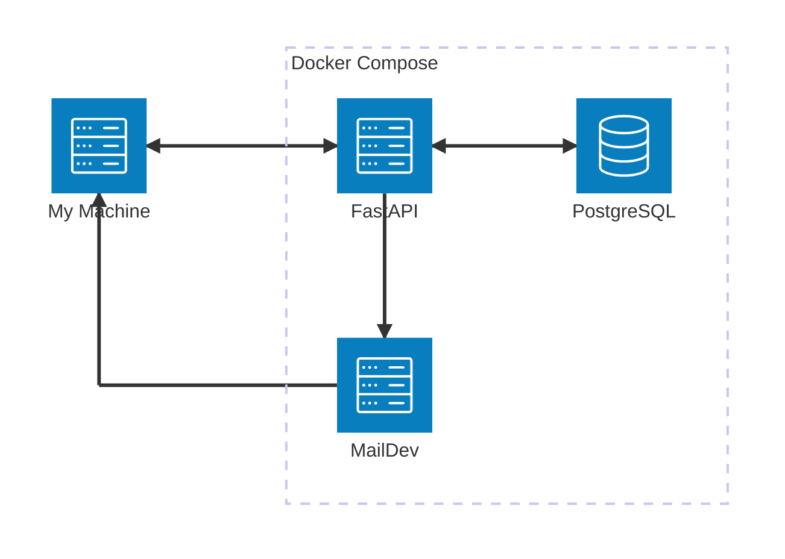
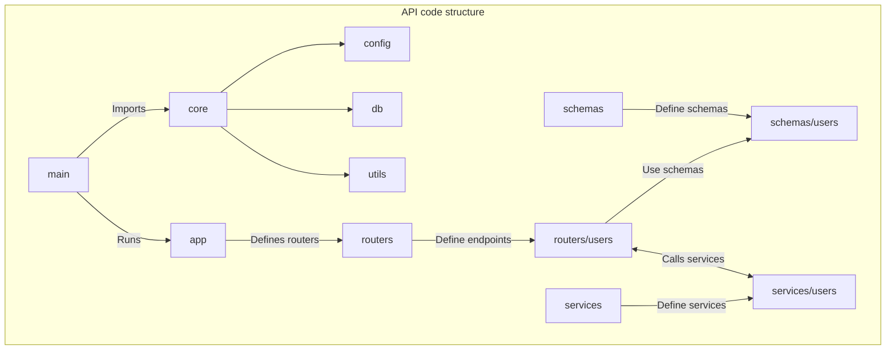

# User Registration API
This repository contains an implementation of API user registration and verification.

## Features
* Create a user with an email and a password.
* Email the user with a 4 digits code.
* Activate a user account with the 4 digits code received using basic authentication.
* The user has only one minute to use this code. An error is raised if used after that.

## Architecture

### Docker services architecture
This backend project is structured in Docker services as follows:
- **FastAPI**: The Python backend API to handle user registration and activation.
- **PostgreSQL**: The SQL database to store users and verification data.
- **MailDev**: The SMTP testing service to simulate user email verification.



### API code structure



## Setup and usage

### Prerequisites
- Install [Docker](https://docs.docker.com/get-docker/) and [Docker Compose](https://docs.docker.com/compose/install/).

### (Optional) Create a custom .env file
By default, the project uses the `.env.example` file. If needed, you can create a custom environment file.

```console
foo@bar:~$ cp .env.example .env.custom
```

Then, modify the `.env.custom` file to fit your needs.

### Start the environment

> [!IMPORTANT]
> Ensure that your environment file is properly configured before running the app.

To start the application using the default configuration:

```console
foo@bar:~$ docker-compose --env-file .env.example up --build
```

If you created a custom `.env` file, specify it as follows:

```console
foo@bar:~$ docker-compose --env-file .env.custom up --build
```

Once running, access the services from your web browser:
- **API**: `http://localhost:<EXPOSED_API_PORT>/docs`
- **Mail**: `http://localhost:<EXPOSED_SMTP_WEB_PORT>`

### Run tests

> [!CAUTION]
> This will create random test data. Do NOT run in a production environment.

To run the tests on the environment:

```console
foo@bar:~$ docker-compose --env_file .env.example exec api pytest
```

If using a custom environment:

```console
foo@bar:~$ docker-compose --env-file .env.custom exec api pytest
```

You'll now see the logs of your running services in the terminal.

### Stop the environment
To stop the running services:

```console
foo@bar:~$ docker-compose --env_file .env.example down
```

If using a custom environment:

```console
foo@bar:~$ docker-compose --env-file .env.custom down
```

### Clean the environment

> [!CAUTION]
> This will erase all stored data. Do NOT run in a production environment.

To stop and remove persistent storage volumes:

```console
foo@bar:~$ docker-compose --env_file .env.example down -v
```

If using a custom environment:

```console
foo@bar:~$ docker-compose --env-file .env.custom down -v
```

## License
The User Registration API is licensed under the terms of the MIT license.
